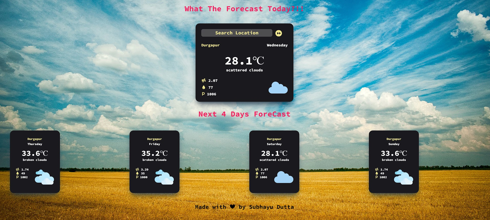

# Weather App

A simple weather application that provides a 5-day weather forecast for a selected location. The app is developed using HTML, CSS, and JavaScript, and it retrieves weather data from a REST API.

## Features

- **5-Day Forecast**: Provides detailed weather predictions, including temperature, precipitation, and wind conditions for the next five days.
- **Easy Location Selection**: Users can quickly select their desired location and access the forecast with an intuitive interface.

## Demo



Check out the live demo: [Weather App](https://subhayudutta.github.io/weatherapp/)

## Installation

1. Clone the repository:

   ```bash
   git clone https://github.com/subhayudutta/weatherapp.git
    ```

2. Navigate to the project directory:
    ```bash
    cd weatherapp
    ```

3. Open index.html in your browser to view the app.

## Usage

1. Open the app in your browser by opening `index.html`.
2. Enter the location for which you want to get the weather forecast.
3. The app will display the weather forecast for the next five days, including temperature, precipitation, and wind conditions.

## Technologies Used

- HTML
- CSS
- JavaScript

## Contact
For any inquiries, please contact duttasuvo90@gmail.com.